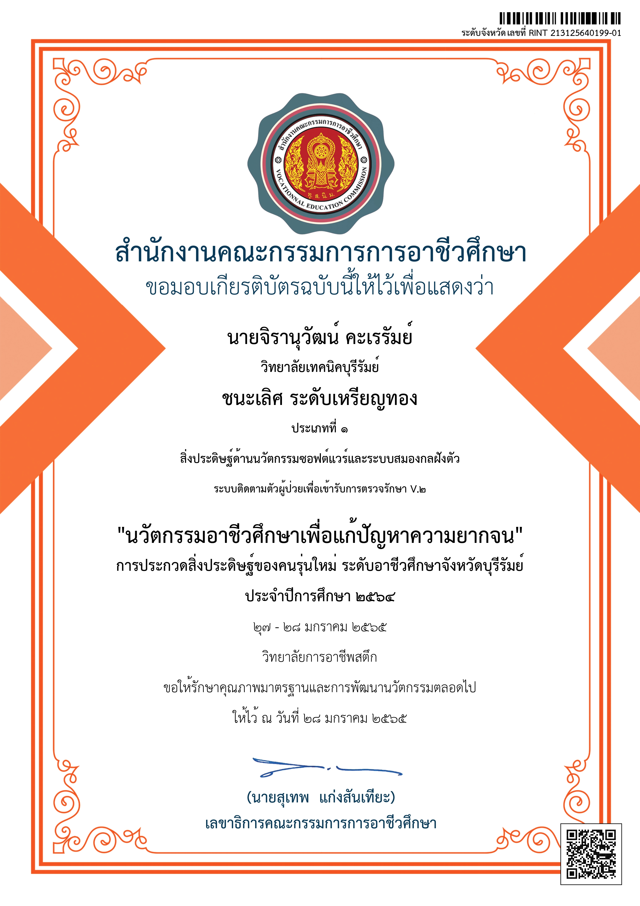
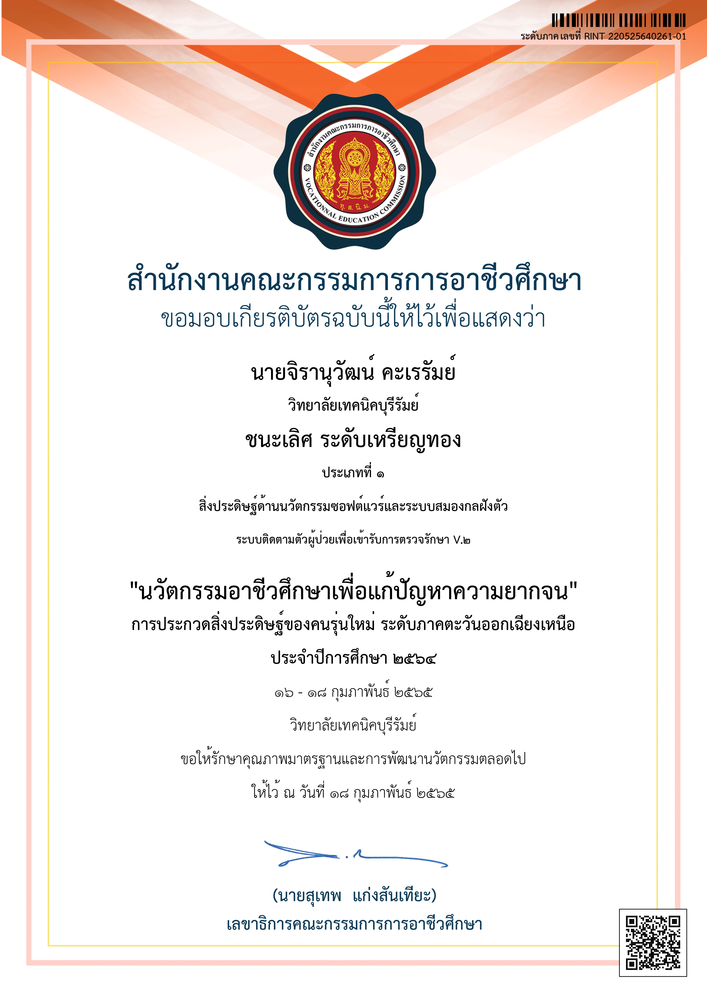
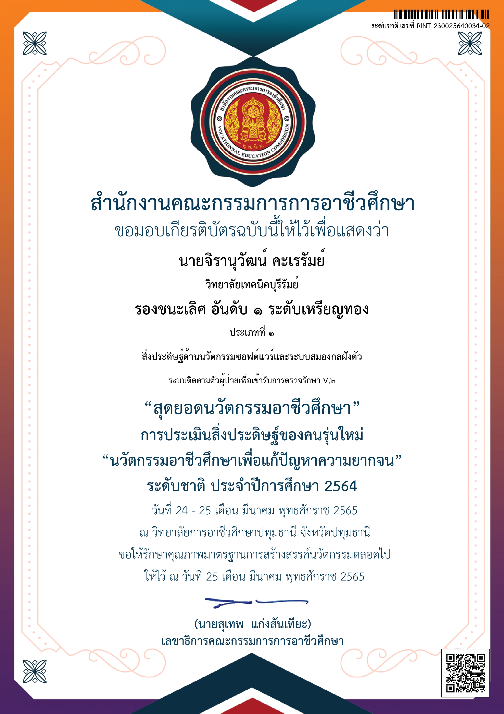

# สิ่งประดิษฐ์

### การประกวดสิ่งประดิษฐ์ของคนรุ่นใหม่ ประจำปีการศึกษา 2564

ประเภทที่ 1 สิ่งประดิษฐ์ด้านนวัตกรรมซอฟต์แวร์และระบบสมองกลฝังตัว ["ระบบติดตามตัวผู้ป่วยเพื่อเข้ารับการตรวจรักษา V.2"](../projects/patienttrackingsystem.md)

<figure><figcaption>
ระดับจังหวัดบุรีรัมย์
</figcaption></figure>

 

<figure><figcaption>
ระดับภาค ภาคตะวันออกเฉียงเหนือ
</figcaption></figure>

<figure><figcaption>
ระดับชาติ
</figcaption></figure>

